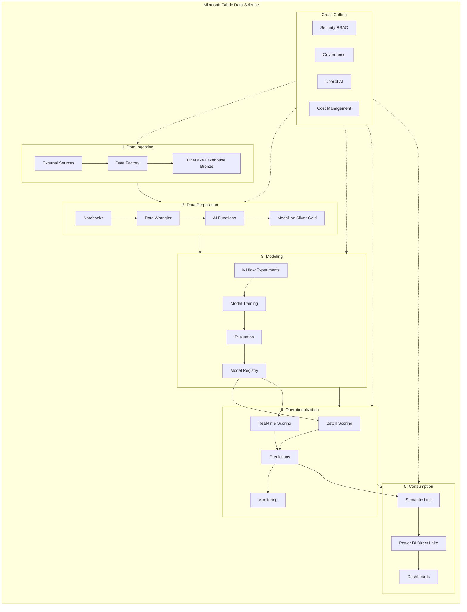
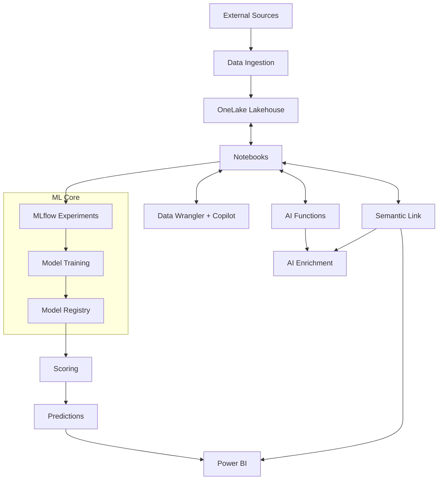
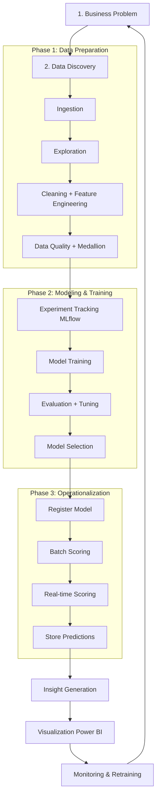
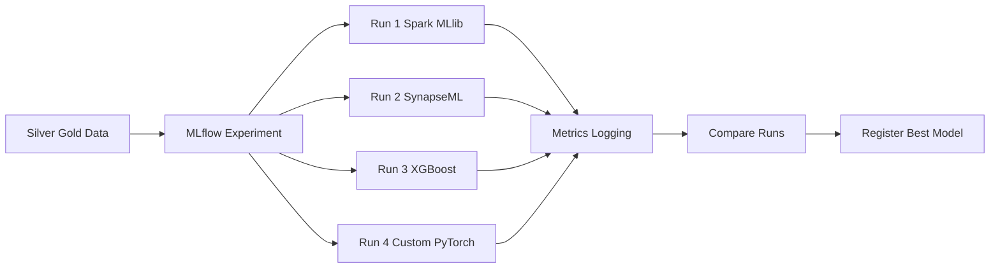
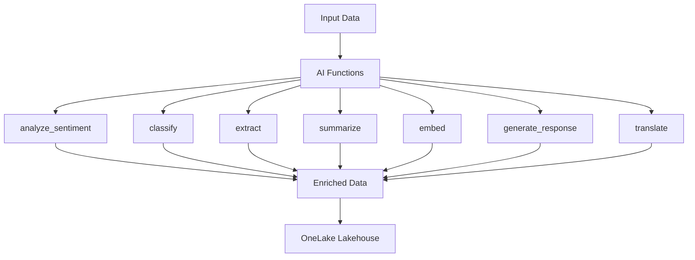

# Microsoft Fabric Data Science - System Analysis (Chi tiết)

**Tài liệu Phân tích Hệ thống**  
**Microsoft Fabric Data Science Experience**  
**Cập nhật:** Tháng 5/2026  
**Nguồn:** https://learn.microsoft.com/en-us/fabric/data-science/

---
Đây là **khối tổng quan lớn** nhất, bao gồm các khối chính. Mỗi khối lớn sẽ chứa các khối nhỏ hơn (chi tiết workflow).

## 1. High-Level Architecture

---

## 2. End-to-End Data Science Workflow

---

## 3. Model Training & Experiment Workflow

---

## 4. AI Functions Workflow

---

## 5. Phân quyền (RBAC)

### Workspace Roles

| Role          | Read | Write | Execute | Manage |
|---------------|------|-------|---------|--------|
| **Admin**     | Yes  | Yes   | Yes     | Yes    |
| **Member**    | Yes  | Yes   | Yes     | No     |
| **Contributor**| Yes | Yes   | Yes     | No     |
| **Viewer**    | Yes  | No    | No      | No     |

### Model & Experiment Permissions

- **Read**: Xem experiments, metrics, models
- **Write**: Tạo, chỉnh sửa, xóa, register model

---

## 6. AI Functions Chính (2026)

- `ai.analyze_sentiment`
- `ai.classify`
- `ai.extract`
- `ai.summarize`
- `ai.embed`
- `ai.generate_response`
- `ai.translate`
- `ai.fix_grammar`

---

**Hướng dẫn sử dụng:**
1. Copy toàn bộ nội dung trên
2. Tạo file mới: `fabric-data-science-analysis.md`
3. Dán vào và lưu
4. Mở trên GitHub → Diagrams sẽ render tốt hơn

---

Bạn muốn tôi bổ sung thêm phần nào nữa không? Ví dụ:
- **Deployment & Scheduling**
- **Monitoring & Cost**
- **Comparison với Azure ML / Databricks**
- **Security Best Practices**

Hãy cho tôi biết để tôi tiếp tục mở rộng!
