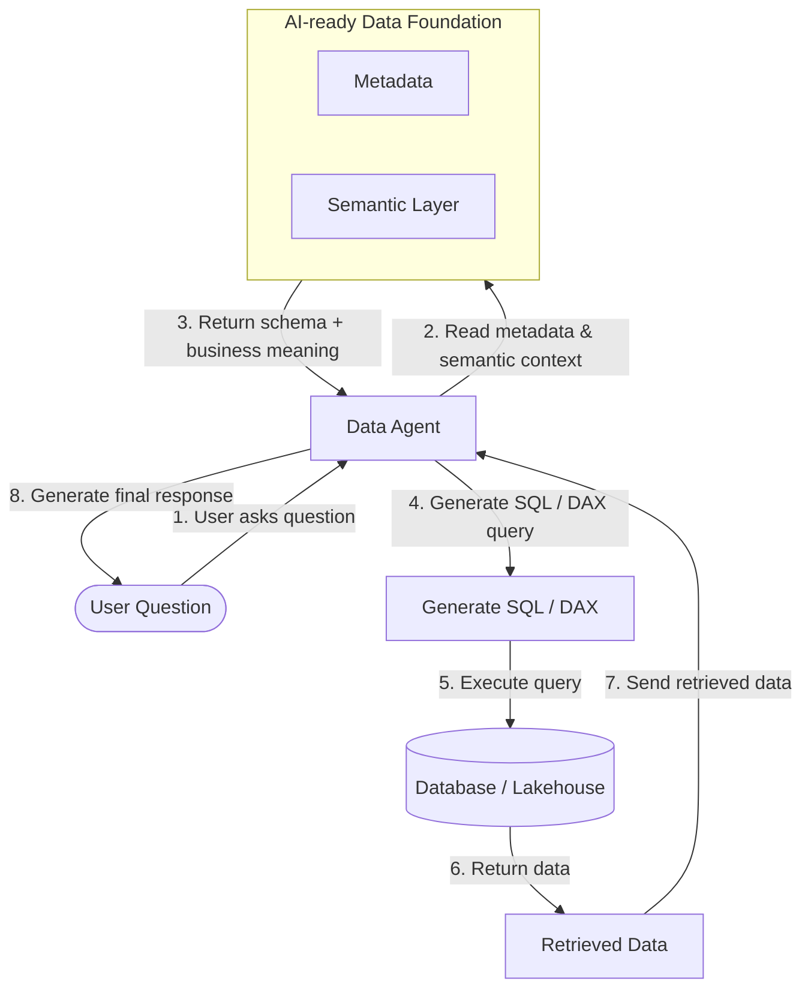

```mermaid
flowchart TD

    U([User Question])

    subgraph F[AI-ready Data Foundation]
        M[Metadata]
        S[Semantic Layer]
    end

    A[Data Agent]

    Q[Generate SQL / DAX]

    D[(Database / Lakehouse)]

    R[Retrieved Data]

    U -->|1. User asks question| A

    A -->|2. Read metadata & semantic context| F
    F -->|3. Return schema + business meaning| A

    A -->|4. Generate SQL / DAX query| Q

    Q -->|5. Execute query| D

    D -->|6. Return data| R

    R -->|7. Send retrieved data| A

    A -->|8. Generate final response| U
```