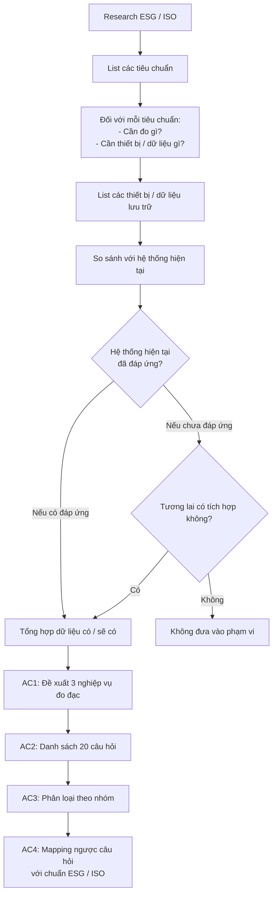

```mermaid
flowchart TD
    A[Research ESG / ISO] --> B[List các tiêu chuẩn]

    B --> C[Đối với mỗi tiêu chuẩn:<br/>- Cần đo gì?<br/>- Cần thiết bị / dữ liệu gì?]

    C --> D[List các thiết bị / dữ liệu lưu trữ]

    D --> E[So sánh với hệ thống hiện tại]

    E --> F{Hệ thống hiện tại<br/>đã đáp ứng?}

    F -->|Nếu có đáp ứng| G[Tổng hợp dữ liệu có / sẽ có]

    F -->|Nếu chưa đáp ứng| H{Tương lai có tích hợp không?}

    H -->|Có| G
    H -->|Không| I[Không đưa vào phạm vi]

    G --> J[AC1: Đề xuất 3 nghiệp vụ đo đạc]
    J --> K[AC2: Danh sách 20 câu hỏi]
    K --> L[AC3: Phân loại theo nhóm]
    L --> M[AC4: Mapping ngược câu hỏi<br/>với chuẩn ESG / ISO]
```
