# Smart City AI/LLM Chatbot – Kế hoạch triển khai với WrenAI × StarRocks

> **Mục tiêu:** Xây dựng hệ thống chatbot cho phép người dùng hỏi bằng ngôn ngữ tự nhiên và nhận câu trả lời dựa trên dữ liệu Smart City theo tiêu chuẩn ISO 37122:2019, triển khai bằng WrenAI kết nối StarRocks.
>
> **v2 – Cập nhật:** Thay OpenAI bằng **DeepSeek qua OpenRouter API** · MDL tổ chức **multi-schema** với lớp **Schema Intent + Join Intent** · Bổ sung hướng dẫn kết nối **StarRocks → WrenAI** chi tiết.

---

## AC1 – Kiến trúc tổng thể

### Các thành phần hệ thống

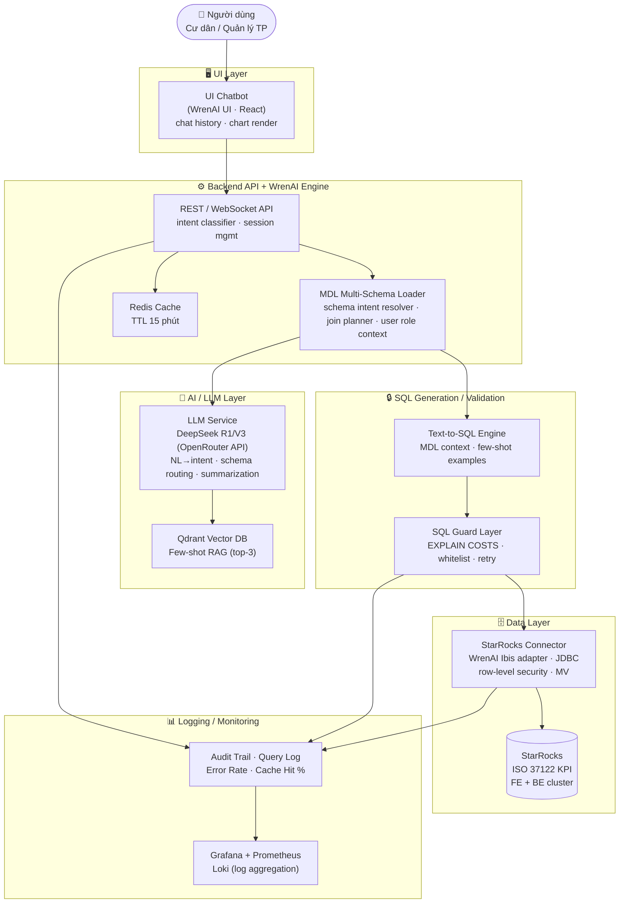

### Mô tả thành phần

| Thành phần | Công nghệ | Vai trò |
|---|---|---|
| UI Chatbot | WrenAI UI (React) | Giao diện chat, render chart/table |
| Backend API | WrenAI Engine · REST/WS | Điều phối luồng, session, cache |
| LLM Service | DeepSeek R1/V3 (OpenRouter API) | Hiểu intent, routing schema, tổng hợp câu trả lời |
| SQL Generation | WrenAI Text-to-SQL | Sinh StarRocks-compatible SQL |
| SQL Validation | Guard Layer | Kiểm tra an toàn, cost estimate |
| StarRocks Connector | WrenAI Ibis Adapter | Kết nối, bảo mật, truy vấn |
| Logging/Monitoring | Grafana + Prometheus + Loki | Quan sát, audit, cảnh báo |
| Vector DB | Qdrant | Lưu few-shot examples ISO 37122 |
| Cache | Redis | Cache kết quả, giảm latency |

---

## AC2 – Luồng xử lý

### Luồng chính (happy path)

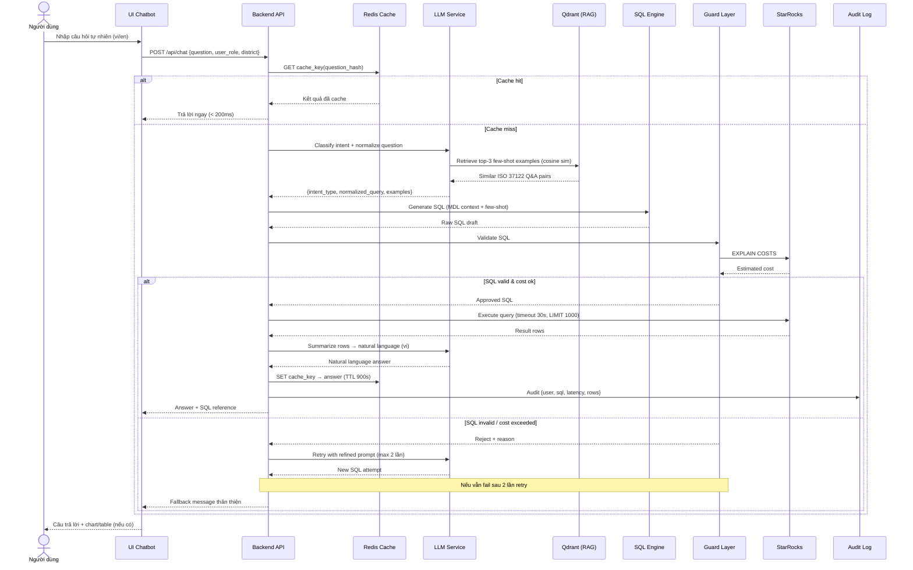

### Phân loại câu hỏi → SQL pattern

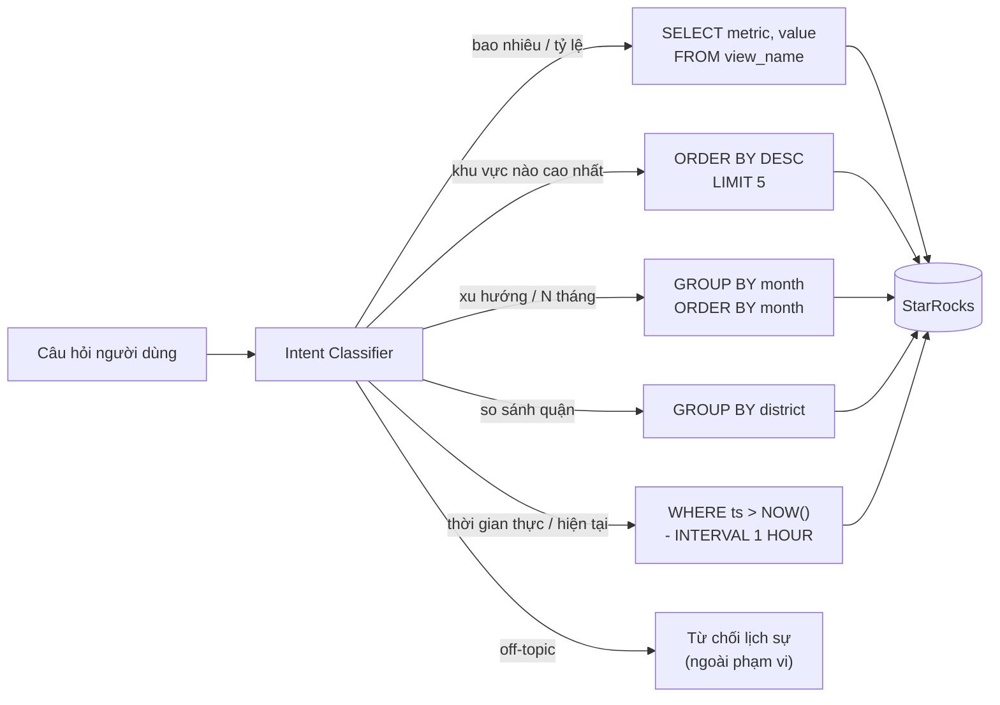

---

## AC3 – Kiểm soát rủi ro

### Ma trận rủi ro và biện pháp

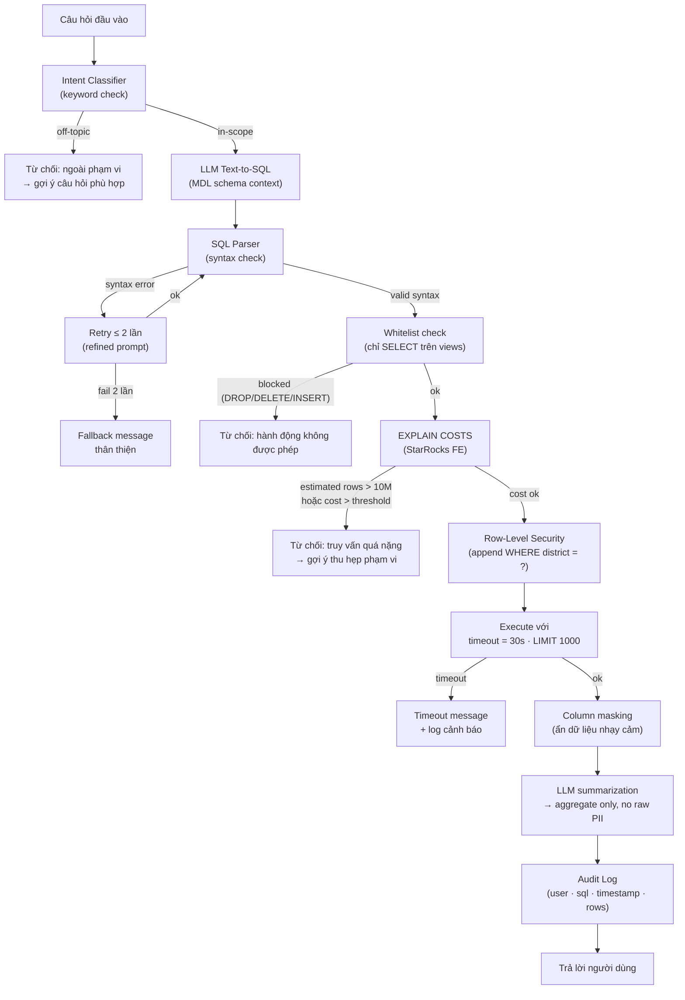

### Bảng kiểm soát rủi ro chi tiết

| Rủi ro | Biện pháp kỹ thuật | Config WrenAI / StarRocks |
|---|---|---|
| LLM sinh SQL sai | MDL schema + SQL parser + retry 2 lần | `sql_validation: strict` |
| Truy vấn quá nặng | EXPLAIN COSTS + LIMIT 1000 tự động + timeout 30s | `SET query_timeout = 30` |
| Câu hỏi ngoài phạm vi | Intent classifier + MDL whitelist (chỉ expose views) | `row_access: views_only` |
| Dữ liệu nhạy cảm | Row-level security + column masking + aggregate only | `row_level_security: true` |
| Overload hệ thống | Redis cache 15 phút + concurrency limit 1 (demo) | `ENABLE_CACHE=true, TTL=900` |

---

## AC4 – Lựa chọn mô hình, framework và prompt

### Lựa chọn LLM – Thay OpenAI bằng DeepSeek qua OpenRouter

| Mô hình | Text-to-SQL | Tiếng Việt | Chi phí | Tốc độ | Khuyến nghị |
|---|---|---|---|---|---|
| **DeepSeek V3 (OpenRouter)** | **Rất tốt** | **Tốt** | ~$0.14/M token input | ~2–4s | ✅ **Demo chọn** |
| **DeepSeek R1 (OpenRouter)** | Xuất sắc (reasoning) | Tốt | ~$0.55/M token input | ~4–8s | ✅ Fallback SQL phức tạp |
| GPT-4o mini (OpenAI) | Rất tốt | Tốt | ~$0.15/M token input | ~2–4s | Thay thế nếu cần |
| Claude 3.5 Haiku (API) | Rất tốt | Tốt | ~$0.25/M token input | ~2–3s | Backup |
| Llama 3.1 8B (local) | Khá | Trung bình | 0$ (RAM 6–8 GB) | 8–20s | Offline only |

#### Cấu hình OpenRouter API trong WrenAI

```yaml
# .env hoặc docker-compose.override.yml
LLM_PROVIDER: openai_compatible          # WrenAI dùng OpenAI-compatible interface
OPENAI_API_BASE: https://openrouter.ai/api/v1
OPENAI_API_KEY: sk-or-v1-xxxxxxxxxxxx   # OpenRouter API key
GENERATION_MODEL: deepseek/deepseek-chat-v3-0324   # DeepSeek V3 (Text-to-SQL)
# Fallback cho câu hỏi phức tạp:
# GENERATION_MODEL: deepseek/deepseek-r1  # DeepSeek R1 (reasoning mode)

# Headers bắt buộc với OpenRouter (thêm vào wren-ai-service config)
OPENROUTER_EXTRA_HEADERS: |
  HTTP-Referer: https://your-project-url
  X-Title: SmartCity-WrenAI
```

```python
# Ví dụ gọi trực tiếp OpenRouter (nếu custom service)
import httpx

async def call_deepseek(prompt: str, schema_context: str) -> str:
    async with httpx.AsyncClient() as client:
        response = await client.post(
            "https://openrouter.ai/api/v1/chat/completions",
            headers={
                "Authorization": f"Bearer {OPENROUTER_API_KEY}",
                "HTTP-Referer": "https://your-project",
                "X-Title": "SmartCity-Chatbot",
            },
            json={
                "model": "deepseek/deepseek-chat-v3-0324",
                "messages": [
                    {"role": "system", "content": schema_context},
                    {"role": "user", "content": prompt}
                ],
                "temperature": 0.1,   # Thấp để SQL ổn định
                "max_tokens": 1024,
            },
            timeout=30.0
        )
    return response.json()["choices"][0]["message"]["content"]
```

> **Lưu ý:** OpenRouter hỗ trợ OpenAI-compatible API nên WrenAI không cần sửa code, chỉ cần đổi `OPENAI_API_BASE` và model name.

### Stack triển khai

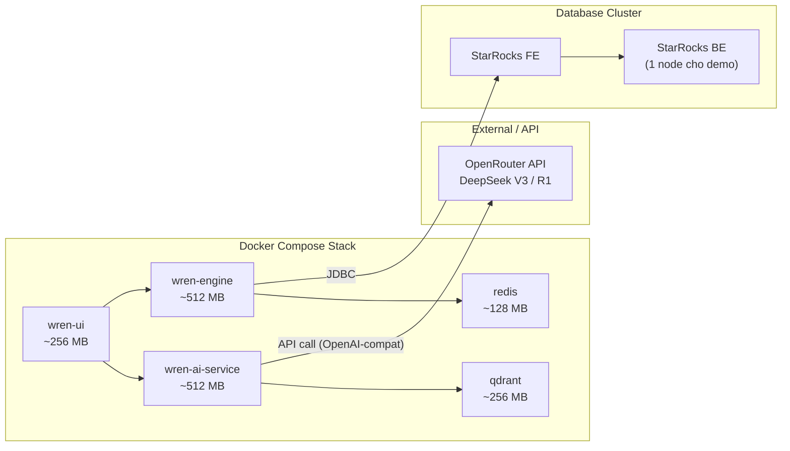

### System Prompt / Instruction Template

```
## Vai trò
Bạn là trợ lý phân tích dữ liệu Smart City Hà Nội, hỗ trợ tra cứu
các chỉ số ISO 37122:2019. Chỉ trả lời dựa trên dữ liệu StarRocks.

## Quy tắc bắt buộc
1. Chỉ dùng views đã khai báo trong MDL schema
2. KHÔNG tự tạo dữ liệu nếu query trả về rỗng
3. Luôn kèm đơn vị đo (%, xe/km², kWh...) vào câu trả lời
4. Câu hỏi liên quan địa lý → filter theo {user_district}
5. Dữ liệu nhạy cảm → chỉ trả về aggregate, không raw

## Phân loại câu hỏi → SQL pattern
- "bao nhiêu / tỷ lệ"      → SELECT metric, value FROM view
- "khu vực nào cao nhất"   → ORDER BY DESC LIMIT 5
- "xu hướng / 3 tháng"     → GROUP BY month ORDER BY month
- "so sánh quận"            → GROUP BY district
- "thời gian thực / hiện tại" → WHERE ts > NOW() - INTERVAL 1 HOUR

## Few-shot examples
{few_shot_examples}  ← top-3 retrieved từ Qdrant (cosine similarity)

## Định dạng trả lời
- Ngôn ngữ: tiếng Việt
- Format: câu văn tự nhiên + số liệu in đậm
- Kèm gợi ý câu hỏi liên quan nếu phù hợp
- Không bịa đặt nếu không có dữ liệu
```

---

---

## AC5 – MDL Multi-Schema: Tổ chức cho dữ liệu đa miền

Khi dữ liệu Smart City có nhiều domain (giao thông, môi trường, năng lượng, y tế, kinh tế…), MDL cần được tổ chức theo **namespace schema** thay vì flat file.

### 5.1 – Cấu trúc MDL Multi-Schema

```
wren-mdl/
├── schemas/
│   ├── transport/          ← Domain giao thông
│   │   ├── _schema.json    ← khai báo namespace + shared dimensions
│   │   ├── view_traffic_flow.json
│   │   ├── view_accident_rate.json
│   │   └── view_public_transit.json
│   ├── environment/        ← Domain môi trường
│   │   ├── _schema.json
│   │   ├── view_air_quality.json
│   │   ├── view_noise_level.json
│   │   └── view_green_space.json
│   ├── energy/             ← Domain năng lượng
│   │   ├── _schema.json
│   │   ├── view_electricity_consumption.json
│   │   └── view_renewable_ratio.json
│   ├── health/             ← Domain y tế
│   │   └── ...
│   └── shared/             ← Shared dimensions (dùng chung)
│       ├── dim_district.json    ← Quận/huyện
│       ├── dim_time.json        ← Thời gian chuẩn
│       └── dim_iso_category.json ← ISO 37122 category mapping
├── intent_schema_map.json  ← Schema Intent routing table
├── join_intent_map.json    ← Cross-schema join definitions
└── wren-mdl-master.json    ← Entry point, load tất cả schemas
```

### 5.2 – Ví dụ `_schema.json` theo namespace

```json
// schemas/transport/_schema.json
{
  "name": "transport",
  "displayName": "Giao thông đô thị",
  "description": "Các chỉ số ISO 37122 nhóm giao thông: luồng xe, tai nạn, vận tải công cộng",
  "namespace": "sc_transport",
  "starRocksDatabase": "smartcity_db",
  "iso_categories": ["4.1", "4.2", "4.3", "4.4"],
  "shared_dimensions": ["dim_district", "dim_time"],
  "models": [
    "view_traffic_flow",
    "view_accident_rate",
    "view_public_transit"
  ]
}
```

```json
// schemas/shared/dim_district.json
{
  "name": "dim_district",
  "type": "dimension",
  "description": "Shared dimension: Quận/Huyện Hà Nội",
  "starRocksTable": "smartcity_db.dim_district",
  "columns": [
    { "name": "district_id", "type": "INTEGER", "primaryKey": true },
    { "name": "district_name", "type": "VARCHAR" },
    { "name": "district_code", "type": "VARCHAR" }
  ]
}
```

### 5.3 – Lớp Schema Intent (mới)

**Schema Intent** là lớp routing: trước khi sinh SQL, hệ thống xác định câu hỏi thuộc **schema domain nào**, để load đúng MDL context thay vì nhét toàn bộ 25+ views vào prompt.

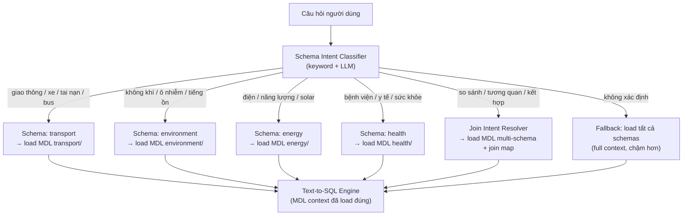

#### `intent_schema_map.json` – Bảng routing Schema Intent

```json
{
  "schema_intent_rules": [
    {
      "schema": "transport",
      "keywords_vi": ["giao thông", "xe", "tai nạn", "phương tiện", "bus", "metro", "ùn tắc", "tốc độ"],
      "keywords_en": ["traffic", "vehicle", "accident", "transit", "bus", "congestion"],
      "iso_categories": ["4.1", "4.2", "4.3", "4.4"],
      "mdl_path": "schemas/transport/"
    },
    {
      "schema": "environment",
      "keywords_vi": ["không khí", "ô nhiễm", "AQI", "tiếng ồn", "cây xanh", "rác"],
      "keywords_en": ["air", "pollution", "noise", "green", "waste", "AQI"],
      "iso_categories": ["7.1", "7.2", "7.3", "8.1"],
      "mdl_path": "schemas/environment/"
    },
    {
      "schema": "energy",
      "keywords_vi": ["điện", "năng lượng", "solar", "tiêu thụ", "tái tạo"],
      "keywords_en": ["electricity", "energy", "solar", "consumption", "renewable"],
      "iso_categories": ["6.1", "6.2"],
      "mdl_path": "schemas/energy/"
    }
  ],
  "fallback": "all_schemas",
  "join_trigger_keywords": ["so sánh với", "tương quan", "ảnh hưởng đến", "kết hợp", "cross"]
}
```

#### Schema Intent trong luồng xử lý

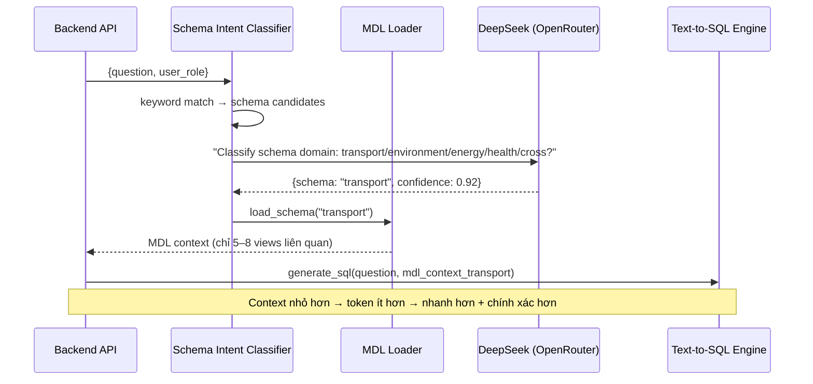

**Lợi ích của Schema Intent:**
- Giảm token prompt 60–70% (load 5–8 views thay vì 25+)
- Tăng độ chính xác SQL vì LLM không bị "nhiễu" schema không liên quan
- Cho phép mở rộng domain mà không làm chậm hệ thống

### 5.4 – Lớp Join Schema Intent (mới)

**Join Schema Intent** xử lý câu hỏi yêu cầu kết hợp dữ liệu từ **nhiều domain khác nhau** – ví dụ "Ô nhiễm không khí có tương quan với mật độ giao thông ở quận Đống Đa không?"

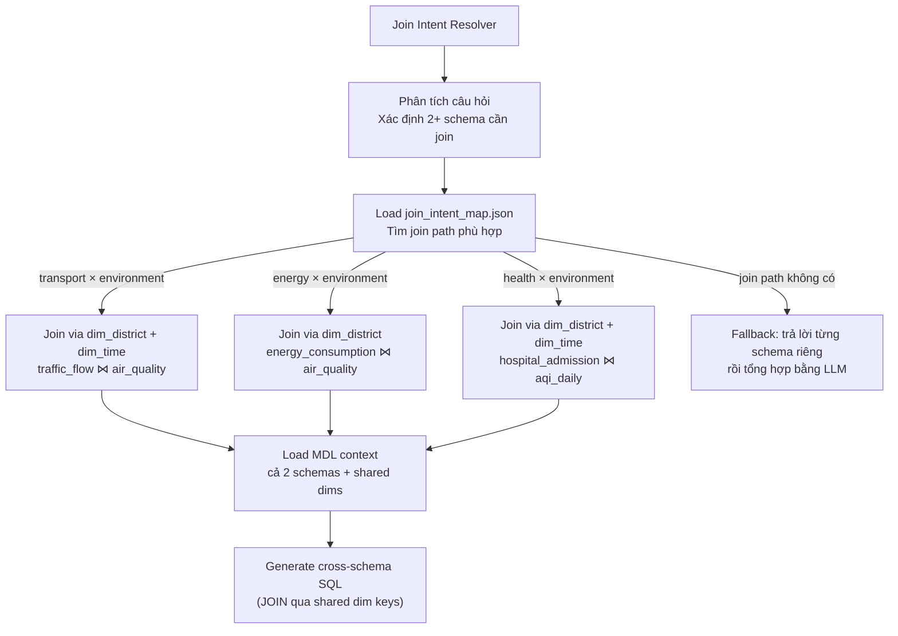

#### `join_intent_map.json` – Định nghĩa cross-schema join paths

```json
{
  "join_paths": [
    {
      "id": "transport_x_environment",
      "schemas": ["transport", "environment"],
      "trigger_phrases_vi": ["giao thông ảnh hưởng ô nhiễm", "mật độ xe và AQI", "tương quan giao thông môi trường"],
      "join_via": "dim_district",
      "join_keys": {
        "transport": "district_id",
        "environment": "district_id"
      },
      "time_align": true,
      "time_key": "report_date",
      "example_sql": "SELECT t.district_name, t.avg_vehicle_density, e.aqi_value FROM view_traffic_flow t JOIN view_air_quality e ON t.district_id = e.district_id AND t.report_date = e.report_date WHERE t.report_date >= DATE_SUB(NOW(), INTERVAL 30 DAY)"
    },
    {
      "id": "energy_x_environment",
      "schemas": ["energy", "environment"],
      "trigger_phrases_vi": ["tiêu thụ điện và ô nhiễm", "năng lượng tái tạo giảm AQI"],
      "join_via": "dim_district",
      "join_keys": { "energy": "district_id", "environment": "district_id" },
      "time_align": true,
      "time_key": "report_month",
      "example_sql": "SELECT e.district_name, e.kwh_per_capita, env.aqi_monthly_avg FROM view_electricity_consumption e JOIN view_air_quality_monthly env ON e.district_id = env.district_id"
    },
    {
      "id": "health_x_environment",
      "schemas": ["health", "environment"],
      "trigger_phrases_vi": ["bệnh hô hấp và ô nhiễm", "sức khỏe và AQI", "nhập viện và không khí"],
      "join_via": ["dim_district", "dim_time"],
      "join_keys": { "health": "district_id", "environment": "district_id" },
      "time_align": true,
      "time_key": "report_date"
    }
  ],
  "fallback_strategy": "answer_separately_then_summarize"
}
```

#### Ví dụ SQL cross-schema được sinh ra

```sql
-- Câu hỏi: "Mật độ xe ở Đống Đa có ảnh hưởng đến chất lượng không khí không?"
-- Join path: transport × environment via dim_district + dim_time

SELECT
    d.district_name,
    t.report_date,
    t.avg_vehicle_density,
    e.aqi_value,
    e.pm25_value
FROM view_traffic_flow t
JOIN view_air_quality e
    ON t.district_id = e.district_id
    AND t.report_date = e.report_date
JOIN dim_district d ON t.district_id = d.district_id
WHERE d.district_name = 'Đống Đa'
  AND t.report_date >= DATE_SUB(NOW(), INTERVAL 30 DAY)
ORDER BY t.report_date DESC
LIMIT 100;
```

---

## AC6 – Kết nối StarRocks → WrenAI: Hướng dẫn chi tiết

### 6.1 – Kiến trúc kết nối

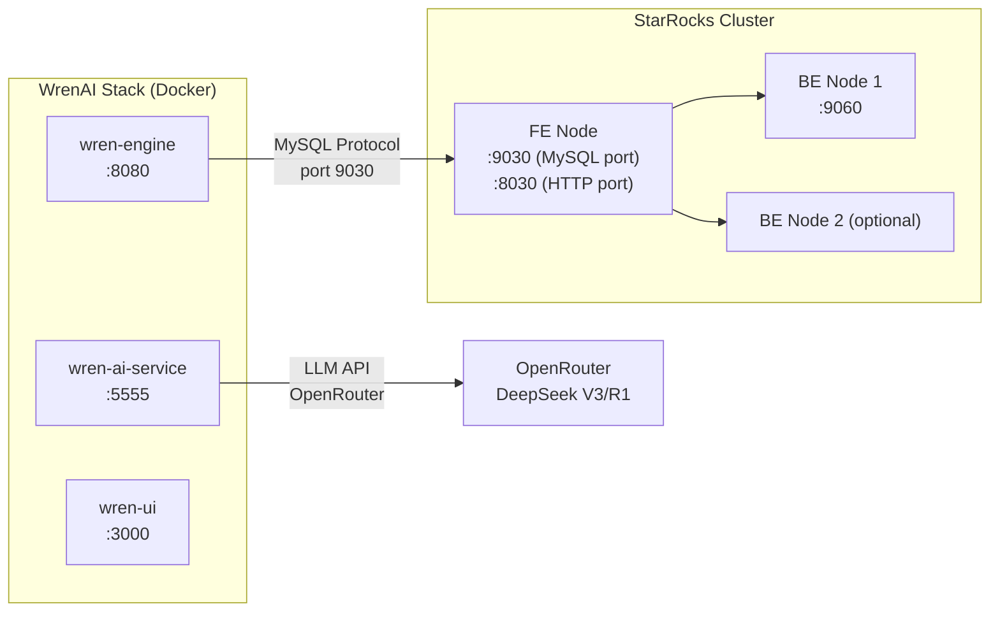

### 6.2 – Cài đặt StarRocks (Docker Compose)

```yaml
# docker-compose.starrocks.yml
version: '3.8'
services:
  starrocks-fe:
    image: starrocks/fe-ubuntu:3.2-latest
    container_name: starrocks-fe
    hostname: starrocks-fe
    environment:
      - HOST_TYPE=FE
    ports:
      - "8030:8030"   # HTTP API
      - "9020:9020"   # RPC
      - "9030:9030"   # MySQL protocol ← WrenAI kết nối qua đây
    volumes:
      - ./starrocks/fe/meta:/opt/starrocks/fe/meta
      - ./starrocks/fe/log:/opt/starrocks/fe/log
    networks:
      - smartcity-net

  starrocks-be:
    image: starrocks/be-ubuntu:3.2-latest
    container_name: starrocks-be
    hostname: starrocks-be
    environment:
      - HOST_TYPE=BE
      - FE_HOST=starrocks-fe
    ports:
      - "8040:8040"
      - "9060:9060"
    volumes:
      - ./starrocks/be/storage:/opt/starrocks/be/storage
      - ./starrocks/be/log:/opt/starrocks/be/log
    depends_on:
      - starrocks-fe
    networks:
      - smartcity-net

networks:
  smartcity-net:
    driver: bridge
```

### 6.3 – Khởi tạo StarRocks: Database + User + Views

```sql
-- Bước 1: Tạo database và user cho WrenAI
CREATE DATABASE IF NOT EXISTS smartcity_db;

CREATE USER IF NOT EXISTS 'wrenai_user'@'%' IDENTIFIED BY 'wrenai_pass_2025';
GRANT SELECT ON smartcity_db.* TO 'wrenai_user'@'%';

-- Bước 2: Tạo bảng KPI mẫu (ISO 37122 - Transport)
USE smartcity_db;

CREATE TABLE IF NOT EXISTS kpi_traffic_flow (
    district_id     INT           NOT NULL,
    district_name   VARCHAR(100)  NOT NULL,
    report_date     DATE          NOT NULL,
    avg_vehicle_density DECIMAL(10,2),  -- xe/km²
    peak_hour_index DECIMAL(5,2),
    congestion_level VARCHAR(20)
)
DUPLICATE KEY(district_id, report_date)
PARTITION BY RANGE(report_date) (
    START ("2024-01-01") END ("2026-01-01") EVERY (INTERVAL 1 MONTH)
)
DISTRIBUTED BY HASH(district_id) BUCKETS 8
PROPERTIES ("replication_num" = "1");

-- Bước 3: Tạo Views (WrenAI chỉ expose views, không expose raw tables)
CREATE VIEW IF NOT EXISTS view_traffic_flow AS
SELECT
    district_id,
    district_name,
    report_date,
    avg_vehicle_density,
    peak_hour_index,
    congestion_level
FROM kpi_traffic_flow;

-- Bước 4: Materialized View để tăng tốc query
CREATE MATERIALIZED VIEW mv_traffic_monthly
REFRESH ASYNC EVERY (INTERVAL 1 HOUR)
AS
SELECT
    district_id,
    district_name,
    DATE_FORMAT(report_date, '%Y-%m') AS report_month,
    AVG(avg_vehicle_density) AS avg_density_monthly,
    MAX(peak_hour_index)     AS max_peak_monthly
FROM kpi_traffic_flow
GROUP BY district_id, district_name, DATE_FORMAT(report_date, '%Y-%m');

-- Bước 5: Row-Level Security (RLS) - theo user role
-- WrenAI sẽ append WHERE clause dựa trên user_district từ session
-- Không cần StarRocks native RLS nếu dùng view + query injection
```

### 6.4 – Cấu hình WrenAI kết nối StarRocks

#### Bước 1: File `.env` cho WrenAI

```bash
# .env – WrenAI configuration
# ─── LLM: DeepSeek qua OpenRouter ───────────────────────────────
LLM_PROVIDER=openai_compatible
OPENAI_API_BASE=https://openrouter.ai/api/v1
OPENAI_API_KEY=sk-or-v1-xxxxxxxxxxxxxxxxxxxx
GENERATION_MODEL=deepseek/deepseek-chat-v3-0324
EMBEDDING_MODEL=openai/text-embedding-3-small   # Hoặc dùng local

# ─── Database: StarRocks ─────────────────────────────────────────
WREN_ENGINE_DATA_SOURCE_TYPE=mysql              # StarRocks dùng MySQL protocol
DB_HOST=starrocks-fe                            # Hostname trong Docker network
DB_PORT=9030                                    # MySQL port của StarRocks FE
DB_USER=wrenai_user
DB_PASSWORD=wrenai_pass_2025
DB_NAME=smartcity_db

# ─── Services ────────────────────────────────────────────────────
WREN_ENGINE_ENDPOINT=http://wren-engine:8080
WREN_AI_ENDPOINT=http://wren-ai-service:5555
QDRANT_HOST=qdrant
QDRANT_PORT=6333
REDIS_URL=redis://redis:6379/0

# ─── Multi-Schema MDL ────────────────────────────────────────────
MDL_PATH=/app/mdl/wren-mdl-master.json
ENABLE_MULTI_SCHEMA=true
SCHEMA_INTENT_CONFIG=/app/mdl/intent_schema_map.json
JOIN_INTENT_CONFIG=/app/mdl/join_intent_map.json
```

#### Bước 2: `wren-mdl-master.json` – Entry point MDL

```json
{
  "catalog": "smartcity",
  "schema": "smartcity_db",
  "multi_schema_mode": true,
  "schema_namespaces": [
    {
      "name": "transport",
      "path": "schemas/transport/",
      "entry": "_schema.json"
    },
    {
      "name": "environment",
      "path": "schemas/environment/",
      "entry": "_schema.json"
    },
    {
      "name": "energy",
      "path": "schemas/energy/",
      "entry": "_schema.json"
    }
  ],
  "shared_dimensions": [
    "schemas/shared/dim_district.json",
    "schemas/shared/dim_time.json",
    "schemas/shared/dim_iso_category.json"
  ],
  "relationships": [
    {
      "name": "traffic_to_district",
      "models": ["view_traffic_flow", "dim_district"],
      "joinType": "MANY_TO_ONE",
      "condition": "view_traffic_flow.district_id = dim_district.district_id"
    },
    {
      "name": "air_quality_to_district",
      "models": ["view_air_quality", "dim_district"],
      "joinType": "MANY_TO_ONE",
      "condition": "view_air_quality.district_id = dim_district.district_id"
    },
    {
      "name": "traffic_x_environment",
      "models": ["view_traffic_flow", "view_air_quality"],
      "joinType": "MANY_TO_MANY",
      "condition": "view_traffic_flow.district_id = view_air_quality.district_id AND view_traffic_flow.report_date = view_air_quality.report_date"
    }
  ]
}
```

#### Bước 3: `docker-compose.yml` hoàn chỉnh

```yaml
version: '3.8'
services:
  # ─── WrenAI Core ──────────────────────────────────────────────
  wren-engine:
    image: ghcr.io/canner/wren-engine:latest
    container_name: wren-engine
    ports:
      - "8080:8080"
    environment:
      - WREN_UI_ENDPOINT=http://wren-ui:3000
    volumes:
      - ./mdl:/app/mdl:ro          # MDL multi-schema files
      - wren_data:/app/data
    depends_on:
      - starrocks-fe
    networks:
      - smartcity-net

  wren-ai-service:
    image: ghcr.io/canner/wren-ai-service:latest
    container_name: wren-ai-service
    ports:
      - "5555:5555"
    env_file: .env
    volumes:
      - ./mdl:/app/mdl:ro
    depends_on:
      - qdrant
      - redis
    networks:
      - smartcity-net

  wren-ui:
    image: ghcr.io/canner/wren-ui:latest
    container_name: wren-ui
    ports:
      - "3000:3000"
    environment:
      - WREN_ENGINE_ENDPOINT=http://wren-engine:8080
      - WREN_AI_ENDPOINT=http://wren-ai-service:5555
    networks:
      - smartcity-net

  # ─── Supporting Services ──────────────────────────────────────
  qdrant:
    image: qdrant/qdrant:latest
    container_name: qdrant
    ports:
      - "6333:6333"
    volumes:
      - qdrant_data:/qdrant/storage
    networks:
      - smartcity-net

  redis:
    image: redis:7-alpine
    container_name: redis
    ports:
      - "6379:6379"
    volumes:
      - redis_data:/data
    networks:
      - smartcity-net

  # ─── StarRocks ────────────────────────────────────────────────
  starrocks-fe:
    image: starrocks/fe-ubuntu:3.2-latest
    container_name: starrocks-fe
    hostname: starrocks-fe
    ports:
      - "8030:8030"
      - "9030:9030"
    volumes:
      - ./starrocks/fe/meta:/opt/starrocks/fe/meta
    networks:
      - smartcity-net

  starrocks-be:
    image: starrocks/be-ubuntu:3.2-latest
    container_name: starrocks-be
    hostname: starrocks-be
    environment:
      - FE_HOST=starrocks-fe
    depends_on:
      - starrocks-fe
    volumes:
      - ./starrocks/be/storage:/opt/starrocks/be/storage
    networks:
      - smartcity-net

volumes:
  wren_data:
  qdrant_data:
  redis_data:

networks:
  smartcity-net:
    driver: bridge
```

### 6.5 – Kiểm tra kết nối StarRocks ↔ WrenAI

```bash
# Bước 1: Kiểm tra StarRocks FE khởi động
curl http://localhost:8030/api/bootstrap
# Mong đợi: {"status":"OK"}

# Bước 2: Kiểm tra MySQL port
mysql -h 127.0.0.1 -P 9030 -u wrenai_user -pwrenai_pass_2025 \
  -e "SHOW DATABASES;" 2>/dev/null
# Mong đợi: smartcity_db xuất hiện trong danh sách

# Bước 3: Kiểm tra WrenAI Engine health
curl http://localhost:8080/v1/health
# Mong đợi: {"status":"healthy","version":"..."}

# Bước 4: Test kết nối từ WrenAI Engine đến StarRocks
curl -X POST http://localhost:8080/v1/connector/test \
  -H "Content-Type: application/json" \
  -d '{
    "type": "mysql",
    "host": "starrocks-fe",
    "port": 9030,
    "database": "smartcity_db",
    "user": "wrenai_user",
    "password": "wrenai_pass_2025"
  }'
# Mong đợi: {"connected":true,"tables":["view_traffic_flow",...]}

# Bước 5: Load MDL schema và validate
curl -X POST http://localhost:8080/v1/mdl/validate \
  -H "Content-Type: application/json" \
  -d @mdl/wren-mdl-master.json
# Mong đợi: {"valid":true,"models":25,"relationships":10}

# Bước 6: Chạy query test qua WrenAI
curl -X POST http://localhost:5555/v1/asks \
  -H "Content-Type: application/json" \
  -d '{"query": "Tổng số phương tiện trung bình mỗi ngày ở Hà Nội là bao nhiêu?"}'
```

### 6.6 – Xử lý lỗi kết nối thường gặp

| Lỗi | Nguyên nhân | Giải pháp |
|---|---|---|
| `Connection refused: 9030` | StarRocks FE chưa ready | Đợi ~60s sau khi start, check `fe/log/fe.log` |
| `Unknown database 'smartcity_db'` | Chưa tạo database | Chạy init SQL script |
| `Access denied for wrenai_user` | Sai GRANT hoặc host | Kiểm tra `GRANT SELECT ON smartcity_db.*` |
| `MDL validation failed: unknown table` | View chưa tồn tại | Tạo views trước khi load MDL |
| `OpenRouter 401` | Sai API key | Kiểm tra `OPENAI_API_KEY` trong `.env` |
| `OpenRouter 429` | Rate limit | Thêm retry backoff, dùng Redis cache |
| `Qdrant: collection not found` | Chưa index few-shot | Chạy `python scripts/index_fewshot.py` |

---


### Tổng quan timeline

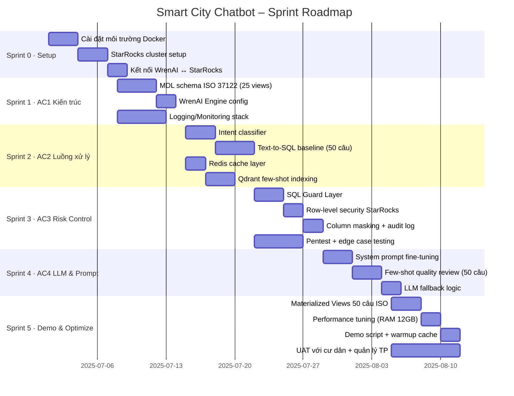

### Chi tiết từng Sprint

---

#### Sprint 0 – Setup & Infrastructure (Tuần 1 · 3–5 ngày)

**Mục tiêu:** Môi trường chạy được, WrenAI kết nối StarRocks thành công.

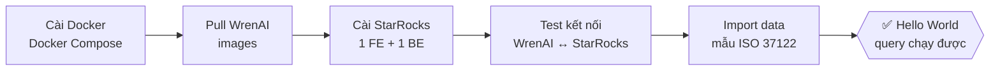

**Checklist:**
- [ ] Docker Compose chạy đủ 5 services (engine, ui, ai-service, qdrant, redis)
- [ ] StarRocks FE + 1 BE khởi động trong ~3 phút
- [ ] WrenAI Ibis connector kết nối StarRocks thành công
- [ ] Chạy thử `SELECT COUNT(*) FROM sample_kpi` qua WrenAI UI
- [ ] RAM tổng < 8 GB khi idle

**Definition of Done:** Query demo đầu tiên trả về kết quả đúng qua WrenAI UI.

---

#### Sprint 1 – AC1: Kiến trúc & MDL Schema (Tuần 1–2 · 5 ngày)

**Mục tiêu:** Định nghĩa đầy đủ MDL cho 25+ ISO 37122 views, monitoring stack hoạt động.

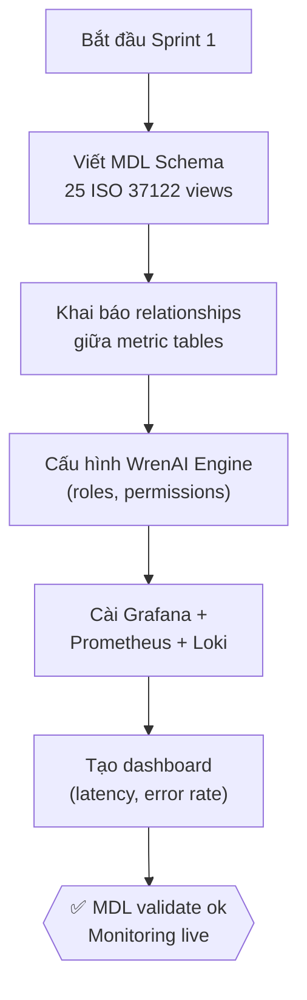

**Output chính:**
- `wren-mdl.json` với 25 views tương ứng 50 câu hỏi AC1
- Grafana dashboard: query latency, error rate, cache hit %
- WrenAI role config: `resident` vs `city_manager`

**Definition of Done:** WrenAI hiển thị đúng 25 views trong schema explorer, monitoring dashboard live.

---

#### Sprint 2 – AC2: Luồng xử lý end-to-end (Tuần 2–3 · 7 ngày)

**Mục tiêu:** Luồng 7 bước chạy hoàn chỉnh, 50 câu hỏi ISO 37122 có câu trả lời đúng ≥ 80%.

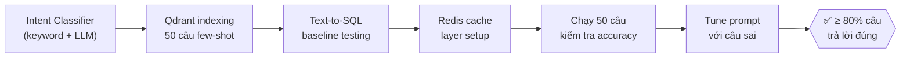

**Metrics đánh giá:**
- SQL accuracy: ≥ 80% câu sinh SQL đúng không cần retry
- Latency p90: < 8s (API mode, không cache)
- Cache hit rate: > 60% sau warmup
- Retry rate: < 20%

**Definition of Done:** 40/50 câu hỏi ISO 37122 cho kết quả đúng, có dữ liệu cache hit.

---

#### Sprint 3 – AC3: Risk Control & Security (Tuần 3 · 5 ngày)

**Mục tiêu:** Toàn bộ 4 loại rủi ro được kiểm soát, pentest không tìm thấy SQL injection.

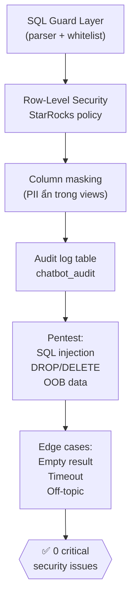

**Test cases bắt buộc:**
- [ ] `DROP TABLE kpi` → bị block bởi whitelist
- [ ] `SELECT * FROM raw_table` → bị block (chỉ views)
- [ ] Câu hỏi off-topic → nhận fallback message
- [ ] Query scan > 10M rows → bị reject với hướng dẫn
- [ ] Resident hỏi data quận khác → chỉ thấy quận mình

**Definition of Done:** 100% test cases bảo mật pass, audit log ghi đầy đủ.

---

#### Sprint 4 – AC4: LLM Tuning & Prompt (Tuần 3–4 · 5–6 ngày)

**Mục tiêu:** Prompt config tối ưu, fallback logic hoạt động, few-shot quality review xong.

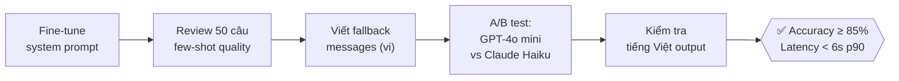

**Output chính:**
- `system_prompt_v2.txt` – prompt production-ready
- `few_shot_50q.jsonl` – 50 câu hỏi ISO 37122 + golden SQL
- `fallback_messages.json` – thông điệp từ chối cho từng loại rủi ro
- Kết quả A/B test: chọn model tốt nhất cho demo

**Definition of Done:** Accuracy tổng ≥ 85%, output tiếng Việt tự nhiên không lỗi ngữ pháp.

---

#### Sprint 5 – Demo Optimization & UAT (Tuần 4–5 · 7 ngày)

**Mục tiêu:** Hệ thống chạy mượt trên máy RAM 12 GB, demo script sẵn sàng, UAT pass.

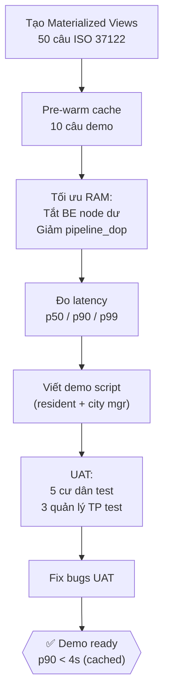

**RAM Budget (12 GB demo machine):**

| Service | RAM |
|---|---|
| StarRocks FE + 1 BE | ~5 GB |
| WrenAI stack (engine + ui + ai-service) | ~1.5 GB |
| Qdrant + Redis | ~0.5 GB |
| OS + Chrome browser | ~2 GB |
| Buffer | ~3 GB |

**Checklist demo:**
- [ ] Materialized Views cho 6 nhóm metric chính đã tạo
- [ ] Redis pre-warmed với 10 câu demo
- [ ] `pipeline_dop = 2` đã set trên StarRocks
- [ ] Demo script 15 phút (5 câu resident + 5 câu city manager)
- [ ] Fallback hoạt động với 3 câu off-topic mẫu

**Definition of Done:** Demo 15 phút không crash, p90 latency < 4s với cache warm.

---

## Workflow tổng quan giữa các Sprint

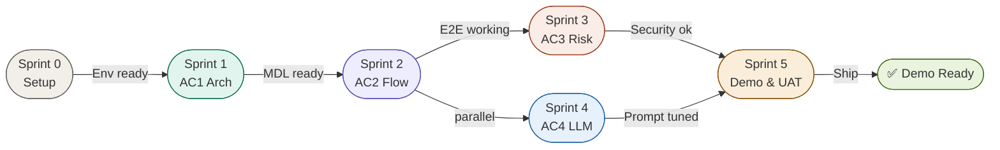

---

## Phụ lục – Tối ưu tốc độ cho máy RAM 12 GB

### Nhóm 1: Tác động cao (giảm 60–80% thời gian chờ)

1. **Dùng LLM API thay local model** – GPT-4o mini qua API: ~2–4s thay vì 15–30s với Llama local, không tốn RAM máy.
2. **Redis cache kết quả truy vấn** – Câu hỏi giống nhau trong 15 phút → trả lời ngay, không gọi LLM.
3. **Tắt StarRocks BE node dư** – Demo chỉ cần 1 BE node, tiết kiệm 2–3 GB RAM.
4. **Pre-warm cache trước demo** – Chạy 10 câu hỏi demo lúc khởi động, cache nóng cho latency < 1s.

### Nhóm 2: Tối ưu StarRocks (giảm 30–50% query time)

5. **Materialized Views cho 50 câu ISO** – Query chỉ đọc aggregate table thay vì scan raw.
6. **Giới hạn Qdrant top-K = 3** – Giảm 40% thời gian embedding lookup.
7. **`SET pipeline_dop = 2`** – Giảm parallelism để tránh OOM khi RAM thấp.
8. **Giới hạn memory WrenAI UI** – `memory: 128m` trong `docker-compose.override.yml`.

### Thứ tự khởi động tối ưu

```
StarRocks FE → StarRocks BE → Redis → Qdrant → WrenAI Engine → WrenAI AI Service → WrenAI UI
```

Đợi mỗi service `healthy` trước khi start service tiếp theo.

---

*Tài liệu này tổng hợp AC1–AC4 cho dự án Smart City AI Chatbot, phiên bản 1.0.*
*Cập nhật lần cuối: Sprint planning session.*