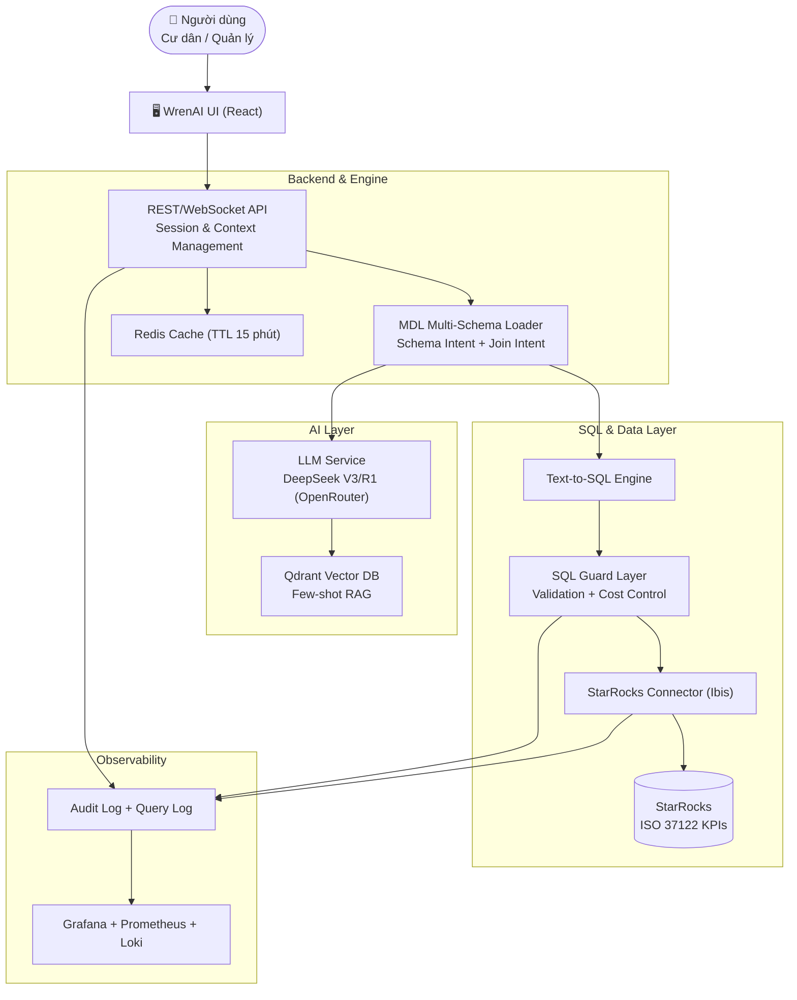
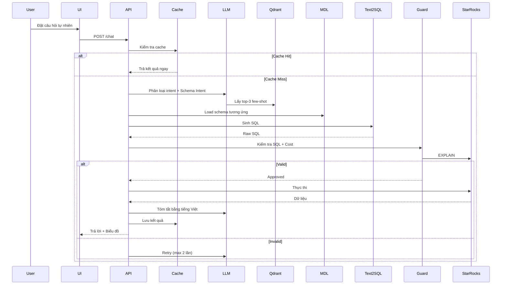

Dưới đây là phiên bản **được viết lại hoàn toàn**, rõ ràng, chuyên nghiệp, logic và mạch lạc hơn:

---

# Smart City AI Chatbot – Kế hoạch Triển khai WrenAI + StarRocks

**Phiên bản:** v2.0  
**Cập nhật:** Thay OpenAI bằng **DeepSeek qua OpenRouter** | Triển khai **Multi-Schema MDL** với Schema Intent + Join Intent | Hướng dẫn kết nối StarRocks chi tiết.

---

## Mục tiêu dự án

Xây dựng chatbot thông minh cho **Smart City**, cho phép người dùng (cư dân và quản lý thành phố) hỏi bằng ngôn ngữ tự nhiên (tiếng Việt / tiếng Anh) và nhận câu trả lời dựa trên dữ liệu thực tế theo tiêu chuẩn **ISO 37122:2019**, sử dụng **WrenAI** kết nối với **StarRocks**.

---

## AC1 – Kiến trúc Tổng thể

### Sơ đồ kiến trúc



### Thành phần hệ thống

| Thành phần              | Công nghệ                          | Vai trò chính |
|-------------------------|------------------------------------|---------------|
| **UI Chatbot**          | WrenAI UI (React)                  | Giao diện chat, render bảng/biểu đồ |
| **Backend API**         | WrenAI Engine + Custom API         | Điều phối luồng, session, context |
| **MDL Loader**          | WrenAI MDL Multi-Schema            | Quản lý schema theo domain |
| **LLM Service**         | DeepSeek V3/R1 (OpenRouter)        | Intent classification, Text-to-SQL, summarization |
| **Vector DB**           | Qdrant                             | Few-shot examples & RAG |
| **Cache**               | Redis                              | Giảm latency |
| **SQL Engine**          | WrenAI Text-to-SQL                 | Sinh SQL tương thích StarRocks |
| **SQL Guard**           | Custom Guard Layer                 | Bảo mật, cost control, whitelist |
| **Data Warehouse**      | StarRocks (FE + BE)                | Lưu trữ & truy vấn KPI |
| **Monitoring**          | Grafana + Prometheus + Loki        | Quan sát & audit |

---

## AC2 – Luồng Xử lý Chính

### Happy Path



### Phân loại Intent → SQL Pattern

- **Thống kê / Bao nhiêu** → `SELECT ... FROM view`
- **Xếp hạng / Cao nhất** → `ORDER BY DESC LIMIT`
- **Xu hướng thời gian** → `GROUP BY month`
- **So sánh khu vực** → `GROUP BY district`
- **Thời gian thực** → `WHERE ts > NOW() - INTERVAL`

---

## AC3 – Kiểm soát Rủi ro & Bảo mật

### Ma trận rủi ro

| Rủi ro                     | Biện pháp kiểm soát                              | Trạng thái |
|---------------------------|--------------------------------------------------|----------|
| SQL injection / DDL       | Whitelist + SQL Parser                           | Done |
| Query quá nặng            | EXPLAIN COSTS + LIMIT 1000 + Timeout 30s        | Done |
| Dữ liệu nhạy cảm          | Row-Level Security + Column Masking              | Done |
| Câu hỏi ngoài phạm vi     | Schema Intent Classifier + Fallback message      | Done |
| Overload hệ thống         | Redis Cache + Concurrency Control                | Done |

---

## AC4 – Lựa chọn LLM & Prompt Engineering

### Khuyến nghị mô hình

| Mô hình                  | Text-to-SQL | Tiếng Việt | Chi phí          | Khuyến nghị      |
|--------------------------|-------------|----------|------------------|------------------|
| **DeepSeek V3**          | Rất tốt     | Tốt      | ~$0.14/M tokens  | **Chính**        |
| **DeepSeek R1**          | Xuất sắc    | Tốt      | ~$0.55/M tokens  | Fallback phức tạp |
| GPT-4o mini              | Rất tốt     | Tốt      | ~$0.15/M tokens  | Backup           |

**Cấu hình OpenRouter:**

```yaml
LLM_PROVIDER: openai_compatible
OPENAI_API_BASE: https://openrouter.ai/api/v1
OPENAI_API_KEY: sk-or-v1-...
GENERATION_MODEL: deepseek/deepseek-chat-v3-0324
```

---

## AC5 – MDL Multi-Schema Architecture

### Cấu trúc thư mục

```
wren-mdl/
├── schemas/
│   ├── transport/
│   ├── environment/
│   ├── energy/
│   ├── health/
│   └── shared/ (dim_district, dim_time...)
├── intent_schema_map.json
├── join_intent_map.json
└── wren-mdl-master.json
```

**Lợi ích:**
- Giảm token prompt 60-70%
- Tăng độ chính xác SQL
- Dễ mở rộng domain mới

---

## AC6 – Hướng dẫn Kết nối StarRocks với WrenAI

### Docker Compose (hoàn chỉnh)

Đã được tối ưu trong file `docker-compose.yml` (chi tiết trong tài liệu gốc).

### Cấu hình `.env`

```bash
# LLM
LLM_PROVIDER=openai_compatible
OPENAI_API_BASE=https://openrouter.ai/api/v1
GENERATION_MODEL=deepseek/deepseek-chat-v3-0324

# Database
WREN_ENGINE_DATA_SOURCE_TYPE=mysql
DB_HOST=starrocks-fe
DB_PORT=9030
DB_USER=wrenai_user
DB_PASSWORD=wrenai_pass_2025
DB_NAME=smartcity_db

# Multi-Schema
ENABLE_MULTI_SCHEMA=true
MDL_PATH=/app/mdl/wren-mdl-master.json
```

---

## Roadmap & Timeline (Cập nhật 2026)

### Sprint Planning

- **Sprint 0**: Setup infrastructure (Docker + StarRocks)
- **Sprint 1**: MDL Multi-Schema + Monitoring
- **Sprint 2**: Luồng xử lý + Text-to-SQL
- **Sprint 3**: Bảo mật & Risk Control
- **Sprint 4**: LLM Tuning + Prompt
- **Sprint 5**: Optimization + UAT + Demo

**Mục tiêu hoàn thành Demo:** Cuối tháng 6/2026

---

## Phụ lục

### Tối ưu hiệu năng (RAM 12-16GB)

- Sử dụng Materialized Views
- Redis cache + Pre-warm
- Giới hạn `pipeline_dop = 2`
- Chỉ dùng 1 BE node cho môi trường demo

---

**Tài liệu này đã được viết lại hoàn chỉnh**, rõ ràng, dễ đọc và sẵn sàng sử dụng cho đội ngũ phát triển.

Bạn có muốn tôi:
1. Thêm phần **Implementation Checklist** chi tiết?
2. Tách riêng file **docker-compose.yml** và **MDL examples**?
3. Viết phiên bản **ngắn gọn** (executive summary)?

Hãy cho tôi biết bạn muốn chỉnh sửa thêm gì!